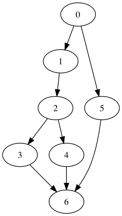

# Branch and Bound for DAG Scheduling

This is an implementation of a branch and bound algorithm for finding the length of the optimal schedule for a DAG similar to that described by [Fujita 2011].

## Compiling

### Build and run unit tests
You can run the tests to make sure all the individualt parts of the implementation are working as expected. This creates an unoptimized binary.
```
make DEBUG=1 && ./tests
```

### Build optimized binary
To build an optimized binary with the default options, just run
```
make
```

To build a binary that uses the Fernandez bound instead of Fujita's binary search method for generating lower bounds, run
```
make FB=1
```

### Build a naive binary
To see how slow the algorithm is without generating lower bounds at all, run
```
make NO_FUJITA=1
```

## Running
Building the project produces the executable `bbexps`. The primary way to use `bbexps` is to find the makespan of a DAG in the Patterson data format.
```
./bbexps <file> <m> <timeout>
```

`m` is the number of machines to schedule the DAG on and `timeout` is the number of seconds to run the branch and bound algorithm for before giving up. `file` is the path to the file containing the DAG to be scheduled. The file should be in the Patterson data format, described below.

### Output
`bbexps` outputs
```
<file>, <n>, <m>, <opt>, <time>
```

where `file` is the input file, `n` is the number of vertices in the DAG (excluding source and sink), `m` is the number of machines used in the schedule, `opt` is the makespan of the DAG or -2 if the algorithm timed out, and `time` is the time it took to run the scheduling algorithm.

### DOT graphs
`bbexps` can alternatively print the input DAG in the DOT graph format. The produced graph does not contain vertex weights, but it is useful for visualizing DAG structure.
```
./bbexps <file> dot
```

An example producing an image might look like
```
./bbexps Pat0.rcp dot | dot -T png -o Pat0.png
```

### Experiments
To run the experiments from the paper run
```
python3 experiments.py
```

This will automatically build the scheduler with the Fernandez bound and with with Fujita's binary search bound and run each on the dataset of generated DAGs. These DAGs were generated using the RanGen 1 tool from Demeulemeester, E., Vanhoucke, M. and Herroelen, W., 2003, "A random network generator for activity-on-the-node networks", Journal of Scheduling, 6, 13-34. The generator was downloaded from [http://www.projectmanagement.ugent.be/?q=research/data/RanGen](http://www.projectmanagement.ugent.be/?q=research/data/RanGen)

To generate graphs, save the output of the experiments in a file and run
```
python3 visualize.py <data file>
```

## Data Format
The Patterson format is used for specifying graphs for the Resource Constrained Project Scheduling Problem, which is a generalization of the DAG scheduling problem we solve. The RCPSP is a common problem in operations research.

The first line of the file has two numbers: the number of vertices (including source and sink), and the number of resources, but the only number of resources we support is 0. The next line contains the resource availability for each resources, but since we have no resources it should always be blank.

Each subsequent line fully specifies one vertex in the DAG, starting with the source and ending with the sink. The first number is the weight of the vertex, then the number of successors, then the ID of each successor. Vertices are 1-indexed, so the source is vertex 1 and the sink is vertex *n*. Normally each line would also contain the resource requirements, but since we have no resources this information is not present.

For example, the file specifying the following DAG is
```

   7    0


   0   2 2 6
   3   1 3
   8   2 5 4
  10   1 7
   2   1 7
  10   1 7
   0   0
```


